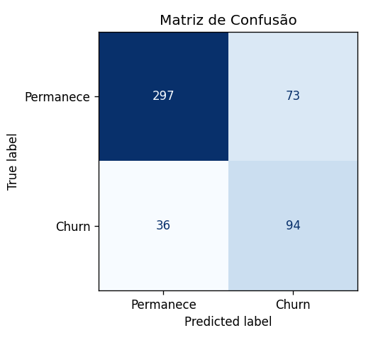
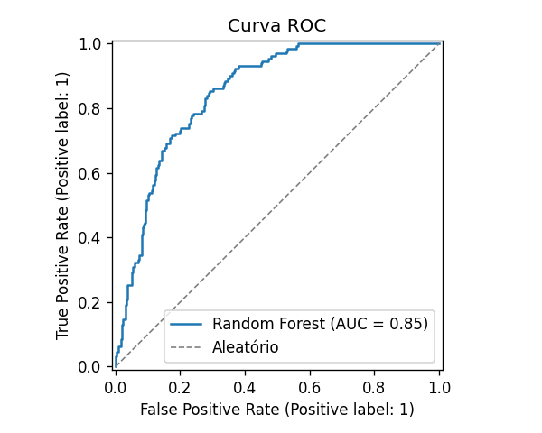
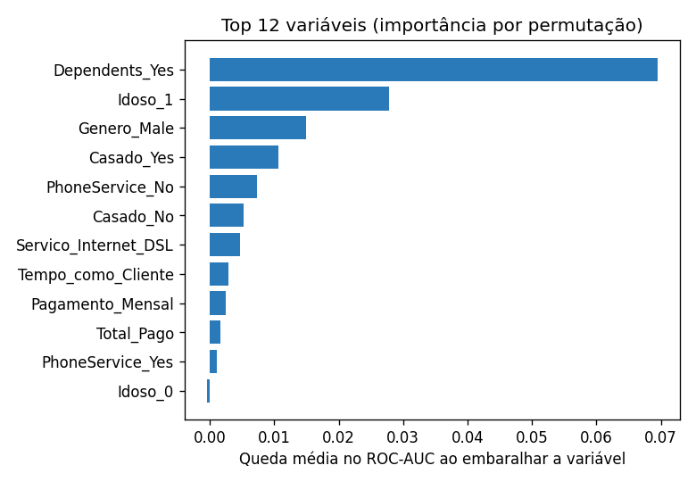

# Predição de Churn em Telecom

Prever **quais clientes estão prestes a cancelar** o serviço, para que o time de
retenção atue antes da evasão. Reter um cliente custa muito menos do que conquistar
um novo — então o objetivo aqui é **capturar o máximo de churn (recall)** mantendo a
precisão em um nível que torne a ação de retenção viável.

> 💡 **Por que este projeto é diferente dos outros do portfólio:** em vez de um único
> notebook, ele é estruturado como **código de produção** — pacote modular, **testes
> automatizados** (`pytest`) e execução reprodutível por linha de comando. Os resultados
> abaixo foram gerados rodando o próprio código (`python -m churn.train`).

## Resultados

Random Forest avaliado em um conjunto de teste de 500 clientes (split estratificado):

| Métrica | Valor |
|---|---|
| ROC-AUC | **0,85** |
| Acurácia | 0,78 |
| Recall (churn) | **0,72** |
| Precision (churn) | 0,56 |
| F1 (churn) | 0,63 |

<p align="center">
  
  
</p>

<p align="center">
  
</p>

**Leitura dos resultados:** o modelo captura ~72% dos clientes que de fato evadem
(ROC-AUC 0,85). A importância por permutação — robusta porque mede a queda real de
desempenho ao embaralhar cada variável — aponta **dependentes, faixa etária (idoso) e
estado civil** como os sinais mais fortes de evasão neste conjunto.

## Os dados

Base pública de churn de uma operadora de telecom: **2.500 clientes**, com taxa de
churn de **~26%**. Inclui dados demográficos, serviços contratados e informações de
faturamento.

Durante a exploração, encontrei e tratei problemas reais de qualidade:

- **`Genero`** vinha com encodings inconsistentes (`Male`, `Female`, `M`, `f`, `F`) —
  consolidados em `Male`/`Female`.
- **`Servico_Internet`** tinha `dsl` em minúsculo misturado com `DSL`.
- **`Total_Pago`** chega vazio para clientes recém-chegados — coagido para numérico e
  imputado dentro do pipeline (sem vazamento de dados).

## Organização

```
churn/
  data.py       Carregamento e limpeza da base
  pipeline.py   Pré-processamento (ColumnTransformer) + modelo, num só Pipeline
  train.py      Treino, avaliação e exportação de artefatos (CLI)
  plots.py      Geração das figuras de avaliação
tests/          Testes de dados e pipeline (pytest)
data/           Dataset versionado (projeto self-contained)
reports/        Saídas geradas: métricas (JSON) e figuras
```

## Como executar

```bash
make install     # instala as dependências
make train       # treina, avalia e gera reports/ (métricas + figuras)
make test        # roda a suíte de testes
```

Sem `make`:

```bash
pip install -r requirements.txt
python -m churn.train
pytest -q
```

## Decisões técnicas

- **Todo o pré-processamento dentro de um `Pipeline`** do scikit-learn: o `fit` ocorre
  apenas no treino, eliminando vazamento de dados e deixando um objeto único pronto para
  serialização/produção.
- **`class_weight="balanced"`** para alinhar o treino ao objetivo de detectar a classe
  minoritária (churn).
- **Avaliação honesta**: split estratificado, ROC-AUC como métrica principal e
  *permutation importance* (independente do modelo) para interpretar os resultados.
- **Reprodutibilidade**: `random_state` fixo e dados versionados com o projeto.

## Stack

`pandas` · `scikit-learn` · `matplotlib` · `pytest`
