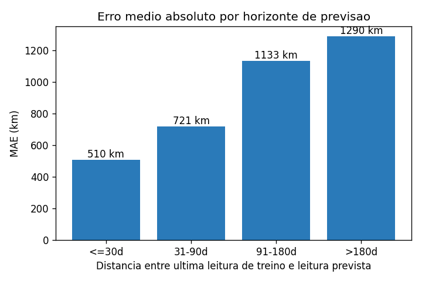
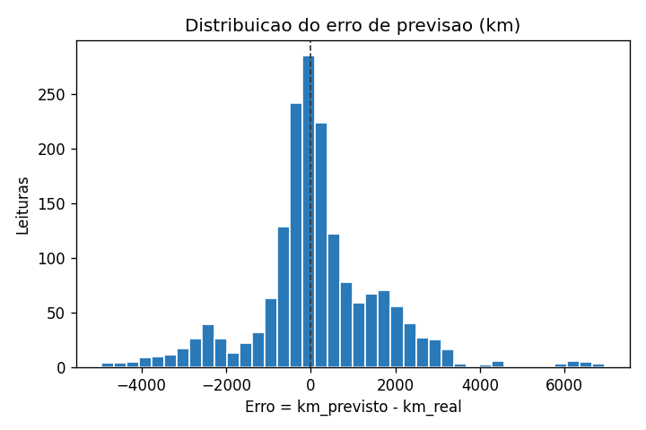
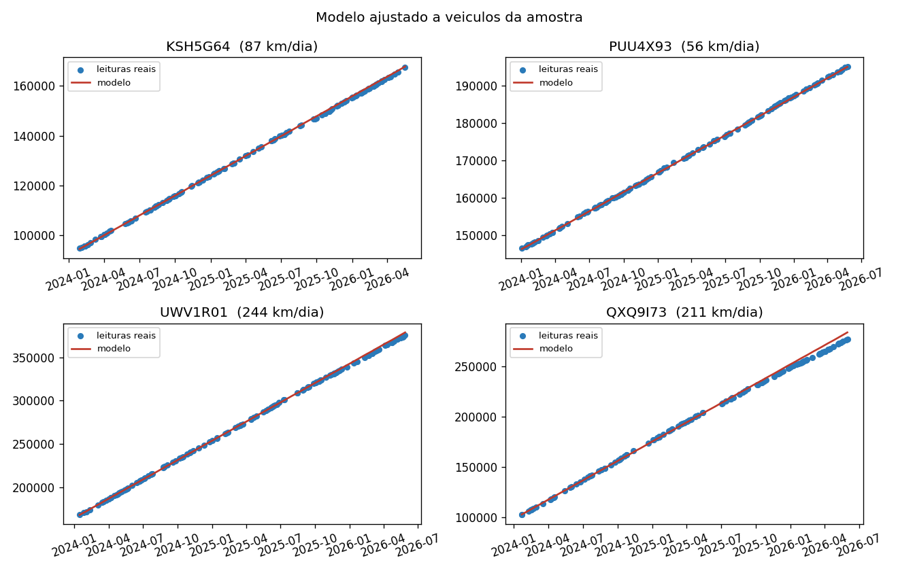

# Previsão de Quilometragem de Frota (MKM)

Modelo de previsão de odômetro **de minha autoria, em uso real** na gestão de uma
frota de veículos. A versão publicada aqui é o **núcleo do modelo** — extraído do
contexto interno para preservar a privacidade dos sistemas de origem — e recebe como
entrada apenas o trio essencial: **`placa`, `data`, `km`**.

Dado esse histórico, o modelo responde a três perguntas práticas que aparecem no
dia a dia da gestão de frota:

- Qual a **quilometragem média diária** de cada veículo?
- Quanto esse veículo deve estar marcando **em uma data futura**?
- Em **quantos dias** ele bate em um km alvo (revisão preventiva, fim de garantia, etc.)?

## Resultados

Avaliado em uma frota sintética de 50 veículos e ~5.900 leituras, com *split*
temporal honesto (treino até a data de corte, teste depois):

| Métrica | Valor |
|---|---|
| MAPE geral | **0,49 %** |
| MAE geral | 1.032 km |
| Mediana do erro | 570 km |
| p90 do erro | 2.575 km |

<p align="center">
  
  
</p>

A degradação por horizonte é a esperada e modesta: ~0,3% até 30 dias, ~0,6% além
de 6 meses. A distribuição de erros é **centrada em zero**, sem viés sistemático
para superestimar ou subestimar.

<p align="center">
  
</p>

## Como o modelo funciona

Para cada placa, é ajustada a relação **km × tempo** com uma estratégia hierárquica
que privilegia robustez sobre sofisticação:

| Histórico do veículo | Estratégia |
|---|---|
| ≥ 4 leituras | Regressão linear (`km = a + b·dia`) — robusta a ruído |
| 2 a 3 leituras | Média de incrementos (Δkm / Δdias) |
| 1 leitura | Herda a **mediana** da taxa diária da frota |

Esse desenho importa porque, em uma operação real, há sempre veículos com anos de
histórico e veículos que entraram ontem. O modelo precisa responder por todos sem
explodir nos *corner cases*.

## Por que receber só `(placa, data, km)`?

A versão interna parte de duas planilhas que se cruzam em vários campos sensíveis
(motoristas, contratos, rotas). Padronizar a entrada no trio mínimo:

- **Preserva a privacidade** dos sistemas que alimentam o modelo.
- Torna o modelo **portável** — qualquer pipeline que produza `(placa, data, km)`
  pode plugá-lo.
- Permite **testes determinísticos** com dados sintéticos, sem depender de
  conexões internas.

## Como executar

```bash
make install     # instala as dependências
make train       # gera frota sintetica, treina e grava reports/
make test        # 11 testes (dados + modelo + smoke end-to-end)

# Previsão pontual com o modelo treinado:
python -m mkm.predict --placa ABC1A23 --data 2027-06-30
python -m mkm.predict --placa ABC1A23 --km-alvo 200000
```

## Organização

```
mkm/
  data.py        Carregamento e validação do trio (placa, data, km)
  synthetic.py   Geração de telemetria sintética reprodutível
  model.py       MKMPredictor — fit/predict/days_to_km
  evaluate.py    Avaliação com split temporal e métricas por horizonte
  plots.py       Gráficos de avaliação (PNG, headless)
  train.py       Orquestrador (CLI: python -m mkm.train)
  predict.py     CLI de previsão pontual (placa + data ou km alvo)
tests/           pytest: dados, modelo e end-to-end
data/            Frota sintetica gerada
reports/         Métricas (JSON) e figuras
```

## Decisões técnicas

- **Avaliação temporal**, não aleatória. *Split* aleatório em série temporal
  vaza informação do futuro para o treino e infla a métrica artificialmente.
- **Métricas por horizonte** (≤30d, 31–90d, 91–180d, >180d). Acertar uma
  previsão de 30 dias e uma de 6 meses são problemas diferentes; o modelo
  precisa ser cobrado em cada um.
- **Limpeza explícita**: leituras decrescentes são descartadas (sinal de troca
  de hodômetro ou erro de digitação), duplicatas no mesmo dia consolidam para
  o maior km.
- **Fallback hierárquico** — Linear → incremental → mediana da frota —
  garante resposta segura mesmo para veículos novos.
- **Reprodutível**: `seed` fixa no gerador sintético e nos testes.

## Stack

`pandas` · `numpy` · `matplotlib` · `joblib` · `pytest`
